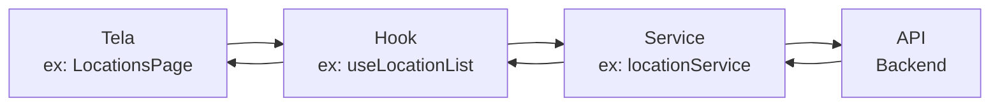
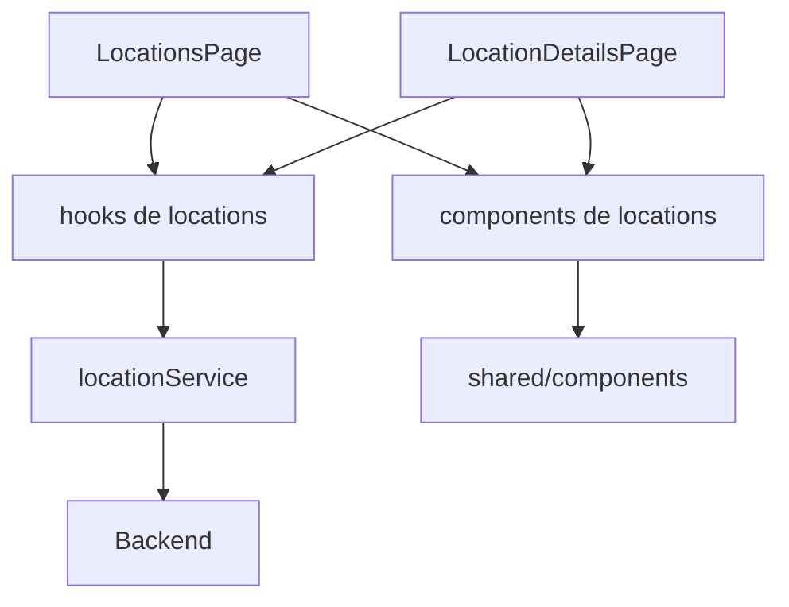
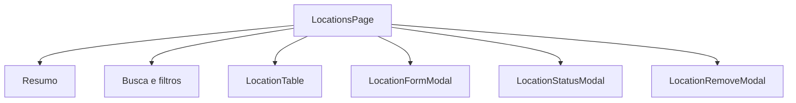
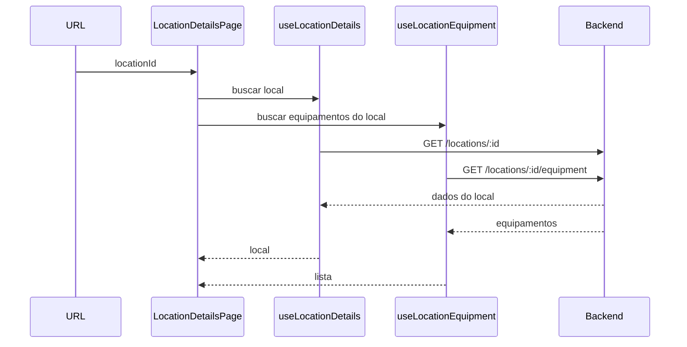
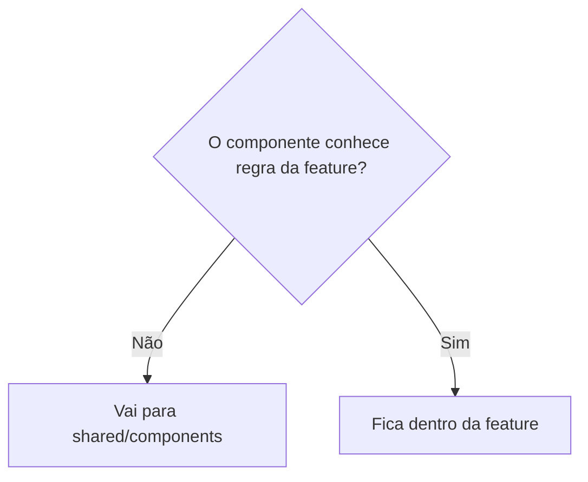
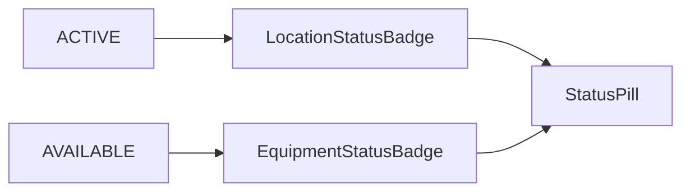
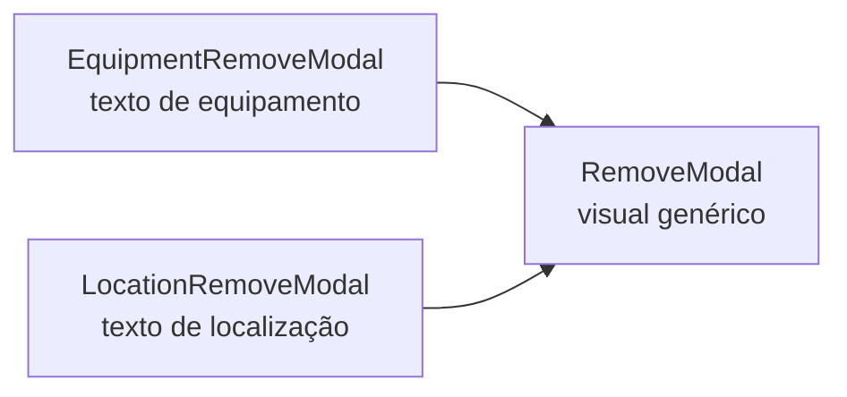

# Aula 08 - Resolução para alunos

Nesta aula, vamos entender como o módulo de Localizações foi finalizado usando
o mesmo padrão do módulo de Equipamentos.

A ideia não é decorar tudo. A ideia é enxergar o caminho dos dados.

## O caminho principal

Quando uma tela precisa de dados, o fluxo é este:

```txt
Tela -> Hook -> Service -> API
```



## O que cada parte faz?

### Page

A page é a tela.

Ela junta:

- estados da tela;
- filtros;
- modais abertos ou fechados;
- chamadas dos hooks;
- funções de clique;
- componentes visuais.

Exemplo:

```txt
LocationsPage
LocationDetailsPage
EquipmentPage
EquipmentDetailsPage
```

### Hook

O hook cuida do estado da requisição.

Normalmente ele devolve:

```txt
data
isLoading
errorMessage
reload
```

Exemplo:

```txt
useLocationList
useLocationDetails
useLocationEquipment
useCreateLocation
useUpdateLocation
```

### Service

O service é o arquivo que conhece a API.

Exemplo:

```txt
locationService.getLocationList()
locationService.createLocation()
locationService.updateLocation()
locationService.deleteLocation()
```

Ele é quem chama URLs como:

```txt
GET /locations
POST /locations
PUT /locations/:id
DELETE /locations/:id
```

### Component

O componente visual mostra as informações na tela.

Exemplo:

```txt
LocationTable
LocationFormModal
LocationStatusModal
LocationRemoveModal
LocationEquipmentCard
```

## Como Localizações foi montado



## Lista de Localizações

Na tela `/locations`, temos:

- cards de resumo;
- campo de busca;
- filtro de situação;
- filtro de tipo;
- tabela;
- paginação;
- modal de cadastro;
- modal de edição;
- modal de alterar situação;
- modal de exclusão.



## Detalhes de uma Localização

Na tela `/locations/:locationId`, o ID vem da URL.

Com esse ID, a tela busca:

- os dados do local;
- os equipamentos vinculados ao local.



## Componentes compartilhados

Algumas partes aparecem em Equipamentos e Localizações. Por isso foram para
`shared/components`.

Exemplos:

```txt
DetailHeader
DetailSummaryCards
DetailInfoCard
DetailTextCard
RemoveModal
StatusModal
StatusPill
```

## Como saber se algo vai para shared?

Pergunte:

```txt
Esse componente sabe alguma regra de equipamento ou localização?
```

Se a resposta for **não**, ele pode ficar em `shared`.

Se a resposta for **sim**, ele fica dentro da feature.



## Exemplo simples: status

`StatusPill` é genérico. Ele só sabe mostrar um texto com uma cor.

```txt
StatusPill recebe:
label
tone
```

Mas ele não sabe o que significa `ACTIVE`, `AVAILABLE` ou `INACTIVE`.

Quem sabe isso é a feature:

```txt
LocationStatusBadge
EquipmentStatusBadge
```



## Exemplo simples: modal de excluir

O modal visual é compartilhado:

```txt
RemoveModal
```

Mas o texto muda por feature:

```txt
EquipmentRemoveModal
LocationRemoveModal
```



## Ordem sugerida para estudar

Comece pela listagem:

```txt
frontend/src/features/locations/pages/LocationsPage/index.tsx
```

Depois veja o hook:

```txt
frontend/src/features/locations/hooks/useLocationList.ts
```

Depois veja o service:

```txt
frontend/src/features/locations/services/locationService.ts
```

Depois veja os componentes:

```txt
frontend/src/features/locations/components/LocationTable
frontend/src/features/locations/components/LocationFormModal
frontend/src/features/locations/components/LocationStatusModal
frontend/src/features/locations/components/LocationRemoveModal
```

Por último, veja os componentes compartilhados:

```txt
frontend/src/shared/components/DataTable
frontend/src/shared/components/RemoveModal
frontend/src/shared/components/StatusModal
frontend/src/shared/components/StatusPill
```

## O que testar na aplicação

Abra:

```txt
/locations
```

Teste:

- buscar local;
- filtrar por situação;
- filtrar por tipo;
- criar local;
- editar local;
- alterar situação;
- excluir local;
- abrir detalhes.

Depois abra:

```txt
/locations/:locationId
```

Teste:

- ver dados do local;
- ver descrição;
- ver equipamentos vinculados;
- clicar em um equipamento vinculado.

## Resumo da aula

O mais importante:

```txt
A tela não chama API direto.
O hook controla a requisição.
O service chama a API.
O componente da feature traduz regra de negócio.
O shared renderiza visual reutilizável.
```

Se você entender esse fluxo, consegue repetir o mesmo padrão em outras telas.
