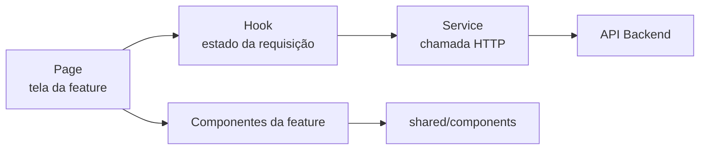
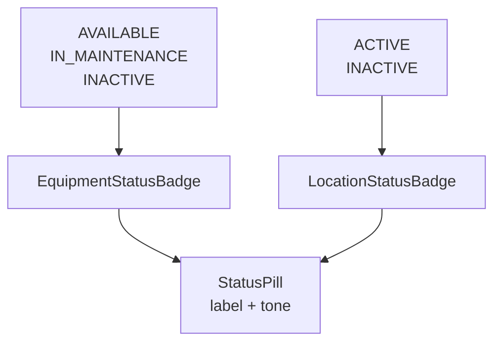
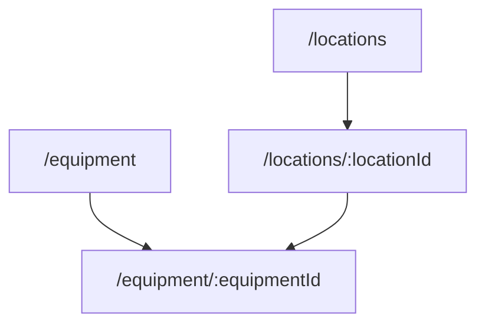
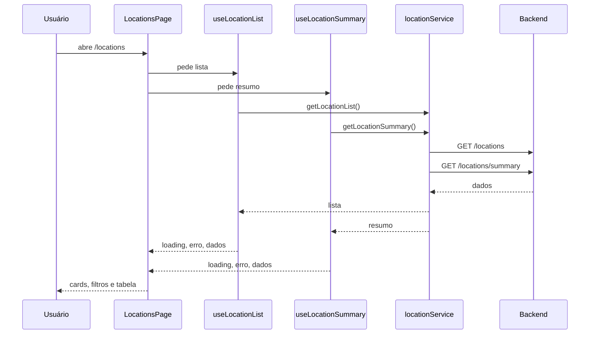
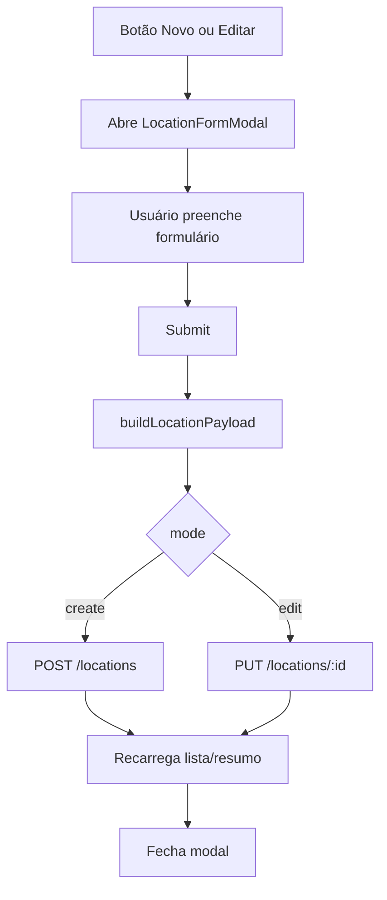
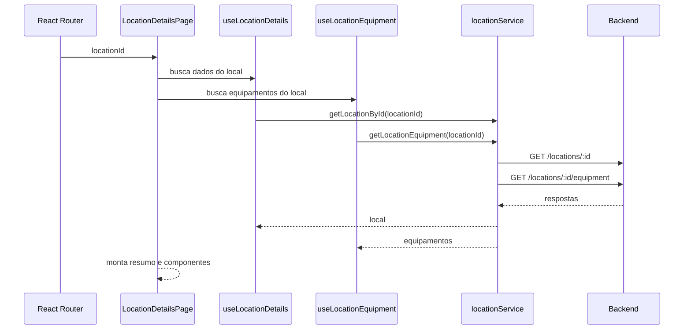
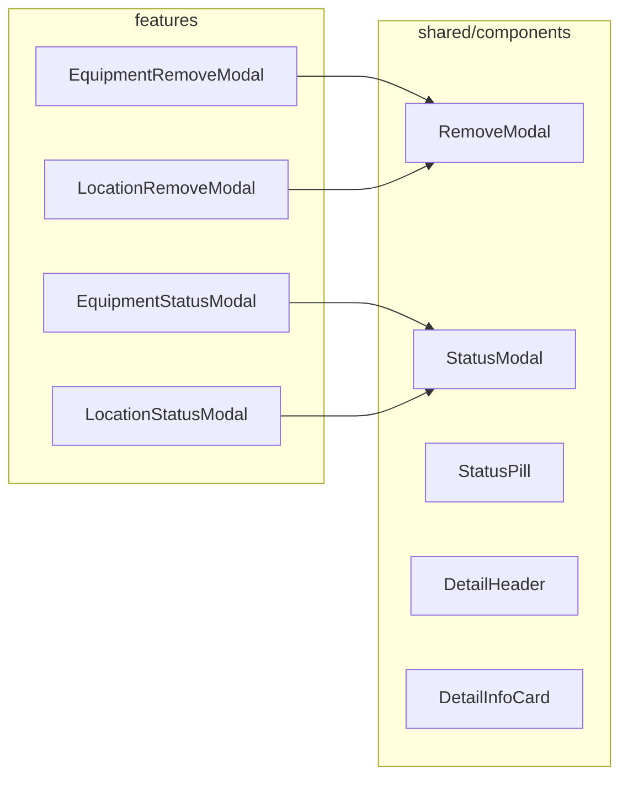

# Aula 08 - Resolução

Este material explica a solução pronta da Aula 08. A ideia é mostrar como o
módulo de Localizações foi construído seguindo o mesmo padrão do módulo de
Equipamentos, sem criar uma arquitetura difícil de entender.

Use este README como roteiro para apresentar a resolução em aula.

## Objetivo da aula

Ao final da aula, o aluno deve conseguir entender:

- como uma tela conversa com a API;
- como separar responsabilidades entre page, hook, service e component;
- quando um componente deve ir para `shared/components`;
- como reaproveitar UI sem esconder regra de negócio;
- como repetir um padrão de uma feature em outra.

## Visão geral

O projeto agora tem duas features principais no frontend:

```txt
features/equipment
features/locations
```

As duas seguem a mesma ideia:

```txt
page -> hook -> service -> API
page -> component
component da feature -> shared component
```



## Regra didática de organização

Esta é a regra mais importante para explicar aos alunos:

```txt
Page: junta tudo que a tela precisa.
Hook: controla loading, erro e dados.
Service: conhece a URL da API.
Feature component: traduz regra da feature.
Shared component: renderiza UI genérica.
```

Exemplo prático:

```txt
EquipmentStatusBadge sabe que AVAILABLE significa "Disponível".
LocationStatusBadge sabe que ACTIVE significa "Ativo".
StatusPill não sabe nada disso. Ele só recebe label e cor.
```



## O que foi entregue

### Localizações

- listagem em `/locations`;
- busca com debounce;
- filtro por situação;
- filtro por tipo;
- paginação;
- cadastro;
- edição;
- alteração de situação;
- exclusão;
- detalhes em `/locations/:locationId`;
- lista de equipamentos vinculados ao local;
- navegação do local para o detalhe do equipamento.

### Equipamentos

O módulo de Equipamentos continuou funcionando e também foi alinhado com os
componentes compartilhados.

O detalhe de Localizações segue a mesma estrutura visual do detalhe de
Equipamentos.

## Rotas principais



## Fluxo da listagem de Localizações

Quando o usuário abre `/locations`, a tela busca a lista e o resumo.



## Fluxo de criar ou editar

Criar e editar usam o mesmo modal. A diferença está no `mode`.



## Fluxo de detalhes de Localizações

O detalhe usa o ID que vem da URL.



## Como explicar os componentes compartilhados

Os componentes compartilhados não devem conhecer regra específica.



### Por que isso é didático?

Porque o aluno consegue responder:

- onde está a regra de negócio?
- onde está a chamada da API?
- onde está o visual reutilizável?
- onde a tela junta tudo?

## Arquivos para demonstrar

Comece por estes arquivos:

```txt
frontend/src/features/locations/pages/LocationsPage/index.tsx
frontend/src/features/locations/pages/LocationDetailsPage/index.tsx
frontend/src/features/locations/services/locationService.ts
frontend/src/features/locations/hooks/useLocationList.ts
frontend/src/features/locations/hooks/useLocationDetails.ts
frontend/src/features/locations/hooks/useLocationEquipment.ts
frontend/src/features/locations/components/LocationTable
frontend/src/features/locations/components/LocationFormModal
frontend/src/features/locations/components/LocationStatusBadge
frontend/src/features/locations/components/LocationEquipmentCard
```

Depois mostre o reaproveitamento:

```txt
frontend/src/shared/components/DataTable
frontend/src/shared/components/DetailHeader
frontend/src/shared/components/DetailSummaryCards
frontend/src/shared/components/DetailInfoCard
frontend/src/shared/components/DetailTextCard
frontend/src/shared/components/RemoveModal
frontend/src/shared/components/StatusModal
frontend/src/shared/components/StatusPill
```

## Pontos bons para destacar em aula

- O nome dos componentes diz a feature: `LocationTable`, `EquipmentTable`.
- Componentes compartilhados têm nome genérico: `StatusPill`, `RemoveModal`.
- O service centraliza as URLs.
- Os hooks evitam que a tela chame axios diretamente.
- Os modais específicos da feature só configuram texto, labels e payload.
- A tela de detalhes fica parecida entre Equipamentos e Localizações.

## Checklist de demonstração

Antes de apresentar:

```txt
npm run lint
npm run build
```

Durante a apresentação:

- abrir `/locations`;
- usar busca;
- usar filtros;
- criar um local;
- editar o local;
- alterar situação;
- tentar excluir local com equipamentos;
- abrir detalhe;
- clicar em um equipamento vinculado.

## Observação sobre o build

O Vite pode mostrar aviso de chunk grande. Isso não quebra o projeto. O aviso
aparece por causa das bibliotecas de UI usadas no frontend.
