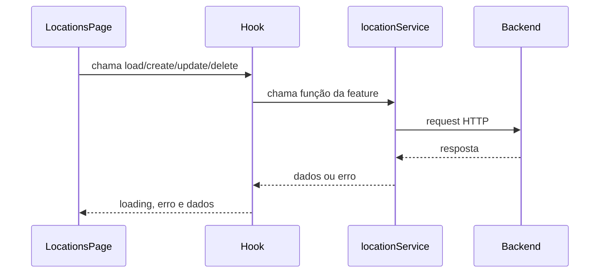

# Aula 08 - Localizações completo

Este material mostra o módulo de Localizações resolvido. Use como referência
para revisar a integração frontend + API e entender como a mesma arquitetura de
Equipamentos foi repetida em outra feature.
Os blocos visuais que são comuns aos dois módulos ficam em `shared/components`;
os arquivos dentro de cada feature apenas adaptam os dados específicos.

## O que observar primeiro

O padrão principal continua sendo:

```txt
service -> hook -> página -> componente visual
```

Em Localizações, esse fluxo aparece assim:



## Caminho na interface

Abra o projeto e navegue por:

```txt
/equipment
/locations
/locations/:locationId
```

Em `/locations`, teste:

- busca;
- filtro de situação;
- filtro de tipo;
- paginação;
- novo local;
- edição;
- mudança de situação;
- exclusão;
- detalhe.

No detalhe de um local, observe:

- cabeçalho com ações;
- cards de resumo;
- informações gerais;
- descrição;
- equipamentos vinculados;
- navegação para o detalhe de um equipamento.

## Arquivos para estudar

```txt
frontend/src/features/locations/pages/LocationsPage/index.tsx
frontend/src/features/locations/pages/LocationDetailsPage/index.tsx
frontend/src/features/locations/services/locationService.ts
frontend/src/features/locations/hooks/useLocationList.ts
frontend/src/features/locations/hooks/useLocationDetails.ts
frontend/src/features/locations/hooks/useCreateLocation.ts
frontend/src/features/locations/hooks/useUpdateLocation.ts
frontend/src/features/locations/hooks/useUpdateLocationStatus.ts
frontend/src/features/locations/hooks/useDeleteLocation.ts
frontend/src/features/locations/components/LocationFormModal
frontend/src/features/locations/components/LocationStatusModal
frontend/src/features/locations/components/LocationRemoveModal
frontend/src/features/locations/components/LocationTable
frontend/src/shared/components/DetailHeader
frontend/src/shared/components/DetailSummaryCards
frontend/src/shared/components/DetailInfoCard
frontend/src/shared/components/DetailTextCard
frontend/src/shared/components/ResourceRemoveModal
frontend/src/shared/components/ResourceStatusModal
```

## Contratos importantes

- `code`: obrigatório, 2 a 20 caracteres, letras maiúsculas, números e hífen;
- `name`: obrigatório, mínimo de 2 caracteres;
- `type`: obrigatório na criação;
- `status`: `ACTIVE` ou `INACTIVE`;
- `description`: texto ou `null`;
- exclusão bem-sucedida retorna `204`;
- localização com equipamentos vinculados retorna erro `409`.

## Checklist da solução

- Localizações lista dados reais.
- Busca, filtros e paginação funcionam.
- Criar e editar salvam na API.
- Alterar situação usa `PATCH`.
- Excluir usa `DELETE`.
- Erro da API aparece para o usuário.
- Detalhe carrega pelo ID da URL.
- Detalhe mostra equipamentos vinculados.
- Detalhe segue o mesmo padrão visual da tela de detalhes de Equipamentos.
- Equipamentos continua funcionando.
- `npm run lint` e `npm run build` passam no frontend.
