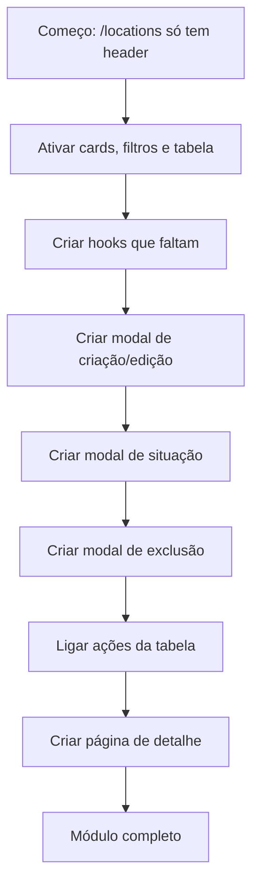
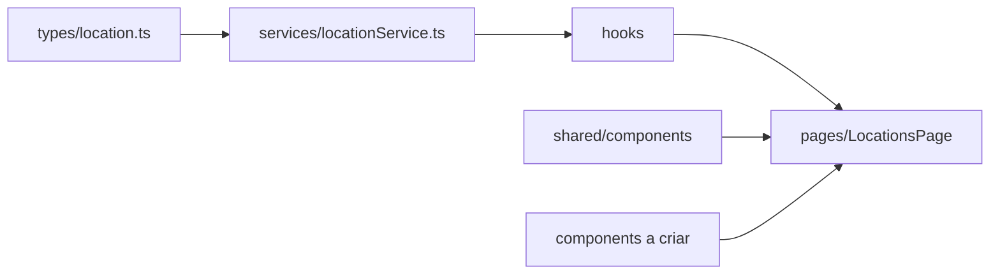
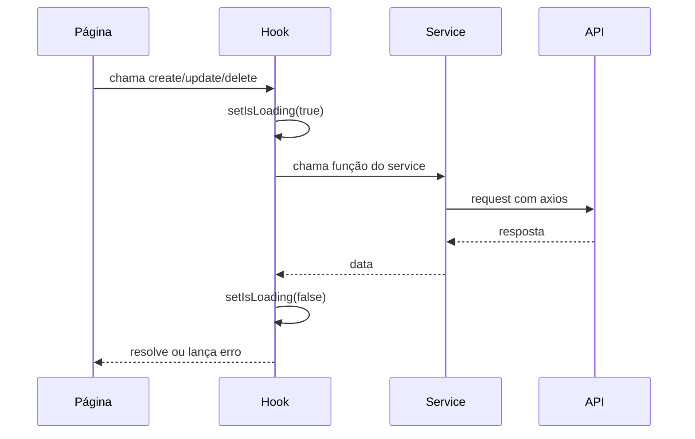
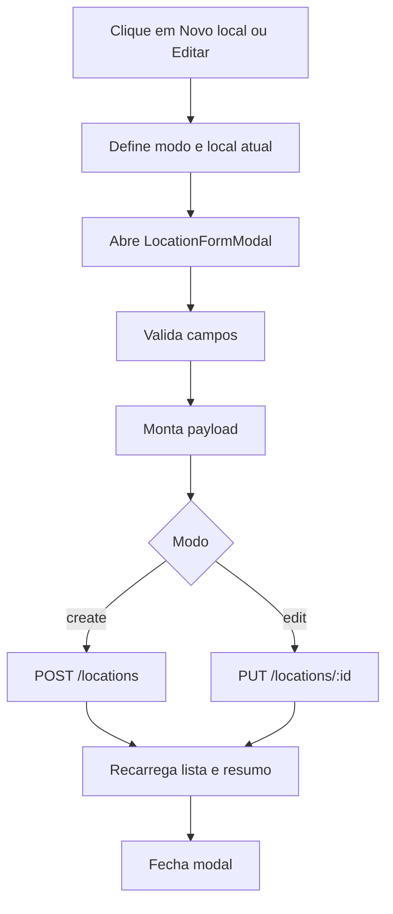
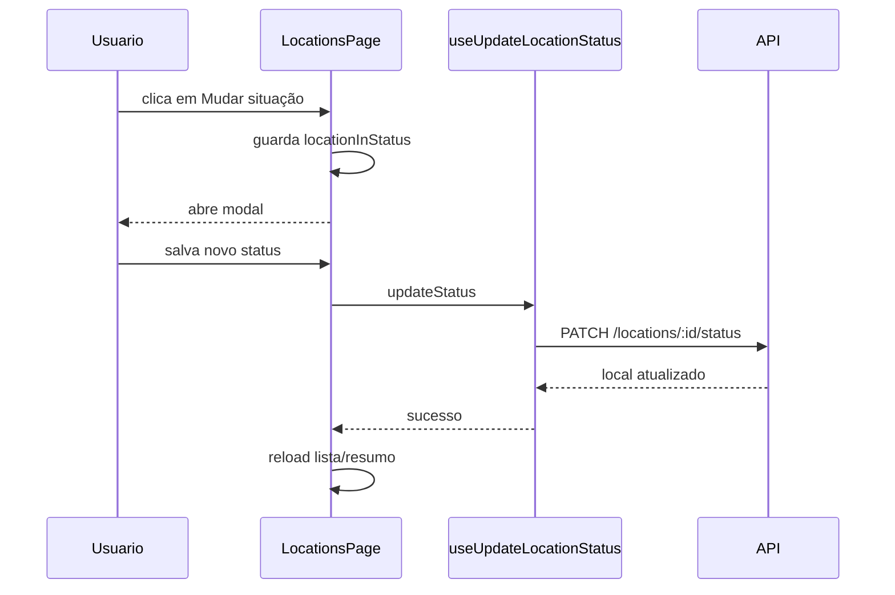
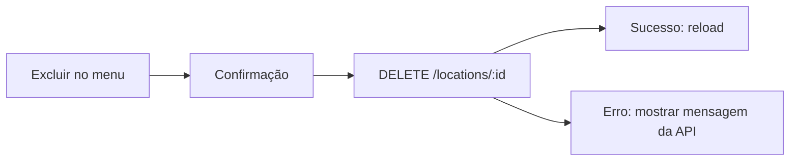

# Trabalho final de casa - Módulo de Localizações

Você vai completar o módulo de Localizações usando Equipamentos como referência.

Equipamentos já está pronto e integrado com a API. Localizações começa com uma
base pronta: types, service, dois hooks e uma página que renderiza só o
cabeçalho. Cards, filtros, tabela, ações e modais estão como blocos comentados
para você ativar aos poucos.

Este trabalho foi pensado para ser feito durante o fim de semana. Leia o roteiro
com calma, implemente uma parte por vez e teste no navegador antes de avançar.

## O que você vai construir



## Antes de começar

Rode o projeto e confira se Equipamentos funciona:

```txt
npm run dev
```

Depois abra:

```txt
frontend/src/features/equipment/pages/EquipmentPage/index.tsx
frontend/src/features/equipment/services/equipmentService.ts
frontend/src/features/equipment/hooks/useEquipmentList.ts
frontend/src/features/equipment/components/EquipmentFormModal
frontend/src/features/equipment/components/EquipmentStatusModal
frontend/src/features/equipment/components/EquipmentRemoveModal
```

O padrão que você vai repetir é:

```txt
service -> hook -> página -> componente visual
```

## Estratégia para o Fim de Semana

Não comece pelos modais. A ordem mais segura é:

1. ativar a listagem visual;
2. garantir que busca, filtros e paginação funcionam;
3. criar os hooks de escrita;
4. criar o modal de formulário;
5. ligar criar e editar;
6. criar alteração de situação;
7. criar exclusão;
8. criar a página de detalhe.

Ao terminar cada etapa, rode a tela no navegador. No fim, rode `npm run build`.

## Mapa dos arquivos de Localizações



Arquivos que já existem:

```txt
frontend/src/features/locations/types/location.ts
frontend/src/features/locations/services/locationService.ts
frontend/src/features/locations/hooks/useLocationList.ts
frontend/src/features/locations/hooks/useLocationSummary.ts
frontend/src/features/locations/pages/LocationsPage/index.tsx
```

## Como ler a página pronta

Abra:

```txt
frontend/src/features/locations/pages/LocationsPage/index.tsx
```

A página começa mostrando somente:

- `PageHeader`: título, descrição e botão "Novo local".

O botão ainda não abre modal. Ele mostra uma mensagem avisando que o cadastro
deve ser implementado neste trabalho.

Depois do header, existem blocos comentados para ativar:

- `SummaryCards`: cards vindos de `GET /locations/summary`;
- `ResourceFilters`: busca, situação, tipo e limpar filtros;
- `Alert`: erro de carregamento;
- `DataTable`: tabela, paginação e scroll responsivo;
- menu de ações: visualizar, editar, mudar situação e excluir.

Os blocos estão separados assim:

1. imports;
2. constantes e helpers visuais;
3. colunas da tabela;
4. estados, hooks e handlers;
5. JSX de cards, filtros, erro e tabela;
6. modais semiprontos de criar, editar e excluir.

O último bloco deixa semiprontas as partes mais difíceis:

- abrir modal de criação;
- abrir modal de edição;
- montar payload antes de salvar;
- salvar criação/edição;
- excluir;
- renderizar modais no final da página.

Use os blocos como mapa. Não descomente tudo de uma vez.

## Passo 0 - Ativar a listagem visual

Antes dos modais, faça a página voltar a listar locais reais.

No arquivo:

```txt
frontend/src/features/locations/pages/LocationsPage/index.tsx
```

Ative os blocos:

1. imports para cards, filtros e tabela;
2. constantes e helpers;
3. colunas da tabela;
4. estados, hooks e handlers;
5. JSX de `SummaryCards`, `ResourceFilters`, `Alert` e `DataTable`.

Depois disso, `/locations` deve mostrar:

- cards de resumo;
- busca;
- filtro de situação;
- filtro de tipo;
- tabela;
- paginação.

## Rotas disponíveis na API

```txt
GET    /api/v1/locations
GET    /api/v1/locations/summary
GET    /api/v1/locations/:locationId
POST   /api/v1/locations
PUT    /api/v1/locations/:locationId
PATCH  /api/v1/locations/:locationId/status
DELETE /api/v1/locations/:locationId
GET    /api/v1/locations/:locationId/equipment
GET    /api/v1/locations/:locationId/equipment-history
```

## Passo 1 - Entender types e service

Leia primeiro:

```txt
frontend/src/features/locations/types/location.ts
frontend/src/features/locations/services/locationService.ts
```

O service já tem as funções prontas. Exemplo:

```ts
async createLocation(payload: CreateLocationPayload): Promise<LocationDetails> {
  const response = await axiosApi.post<LocationDetails>('/locations', payload)

  return response.data
}
```

Isso significa: o hook não precisa saber URL. O hook chama o service.

## Passo 2 - Criar os hooks que faltam

Já existem:

```txt
useLocationList
useLocationSummary
```

Crie:

```txt
useLocationDetails
useCreateLocation
useUpdateLocation
useUpdateLocationStatus
useDeleteLocation
useLocationEquipment
useLocationHistory
```

Use os hooks de Equipamentos como modelo:

```txt
frontend/src/features/equipment/hooks/useCreateEquipment.ts
frontend/src/features/equipment/hooks/useUpdateEquipment.ts
frontend/src/features/equipment/hooks/useUpdateEquipmentStatus.ts
```

Diagrama do hook:



## Passo 3 - Criar o formulário

Copie a estrutura de:

```txt
frontend/src/features/equipment/components/EquipmentFormModal
```

Crie:

```txt
frontend/src/features/locations/components/LocationFormModal
```

Campos esperados:

- `code`: obrigatório;
- `name`: obrigatório;
- `type`: obrigatório;
- `building`: opcional;
- `floor`: opcional;
- `room`: opcional;
- `description`: opcional;
- `status`: opcional ou obrigatório, conforme sua decisão de UX.

Tipo sugerido:

```ts
export type LocationFormMode = 'create' | 'edit'

export interface LocationFormValues {
  code: string
  name: string
  type?: LocationType
  building?: string
  floor?: string
  room?: string
  description?: string
  status?: LocationStatus
}
```

## Passo 4 - Integrar criação e edição

Na `LocationsPage`, troque o botão "Novo local" para abrir o modal. O bloco 6
do arquivo já mostra os estados, handlers e JSX dos modais.

Fluxo:



O bloco comentado em `LocationsPage` já mostra:

- estados do modal;
- função `buildLocationPayload`;
- `handleCreateLocation`;
- `handleEditLocation`;
- `handleSubmitLocationForm`.

## Passo 5 - Alterar situação

Copie a ideia de:

```txt
frontend/src/features/equipment/components/EquipmentStatusModal
```

Crie:

```txt
frontend/src/features/locations/components/LocationStatusModal
```

Payload esperado:

```ts
{
  status: values.status,
  note: values.note?.trim() || null,
}
```

Fluxo:



## Passo 6 - Excluir localização

Copie a ideia de:

```txt
frontend/src/features/equipment/components/EquipmentRemoveModal
```

Crie:

```txt
frontend/src/features/locations/components/LocationRemoveModal
frontend/src/features/locations/hooks/useDeleteLocation.ts
```

A API bloqueia exclusão quando existe equipamento vinculado. Por isso, use:

```ts
messageApi.error(getRequestErrorMessage(error))
```

Fluxo:



## Passo 7 - Ligar o menu de ações

Hoje o menu visual da tabela chama uma mensagem temporária.

Troque para:

- `Ver detalhes` -> navegar para `/locations/:locationId`;
- `Editar` -> abrir `LocationFormModal` em modo edição;
- `Mudar situação` -> abrir `LocationStatusModal`;
- `Excluir` -> abrir `LocationRemoveModal`.

No código, procure:

```ts
handlePendingLocationFeature
```

Esse é o ponto temporário que deve sair quando as ações reais entrarem.

## Passo 8 - Criar página de detalhe

Crie:

```txt
frontend/src/features/locations/pages/LocationDetailsPage/index.tsx
frontend/src/features/locations/pages/LocationDetailsPage/styles.ts
```

Adicione rota em:

```txt
frontend/src/app/App.tsx
```

Rota sugerida:

```tsx
<Route path="/locations/:locationId" element={<LocationDetailsPage />} />
```

Na página de detalhe, use:

- `useParams` para pegar `locationId`;
- `useLocationDetails`;
- `useLocationEquipment`;
- `useLocationHistory`.

Conteúdo esperado:

- cabeçalho com nome, código e situação;
- informações gerais;
- cards com resumo de equipamentos;
- tabela/lista de equipamentos vinculados;
- histórico de movimentações.

## Passo 9 - Reaproveitar componentes compartilhados

Já estão em `shared`:

```txt
frontend/src/shared/components/PageHeader
frontend/src/shared/components/SummaryCards
frontend/src/shared/components/ResourceFilters
frontend/src/shared/components/DataTable
frontend/src/shared/http/getRequestErrorMessage.ts
frontend/src/shared/hooks/requestState.ts
```

Use esses componentes antes de criar algo novo.

Pode copiar de Equipamentos quando ainda for específico:

- modal de formulário;
- modal de status;
- modal de exclusão;
- cabeçalho de detalhe;
- cards do detalhe.

Regra prática: copie primeiro para entender; só mova para `shared` quando dois módulos realmente usarem a mesma coisa.

## Checklist de entrega

- `/locations` lista dados reais.
- Busca com debounce funciona.
- Filtro de situação funciona.
- Filtro de tipo funciona.
- Paginação funciona.
- Botão "Novo local" abre formulário.
- Formulário cria local.
- Ação "Editar" abre formulário preenchido.
- Edição salva local.
- Ação "Mudar situação" abre modal.
- Situação salva via PATCH.
- Ação "Excluir" abre confirmação.
- Exclusão remove local ou mostra erro da API.
- Ação "Ver detalhes" navega para detalhe.
- Detalhe carrega pelo ID da URL.
- Detalhe mostra equipamentos vinculados.
- Detalhe mostra histórico.
- Loading aparece em requests.
- Erros aparecem com mensagem simples.
- Equipamentos continua funcionando.
