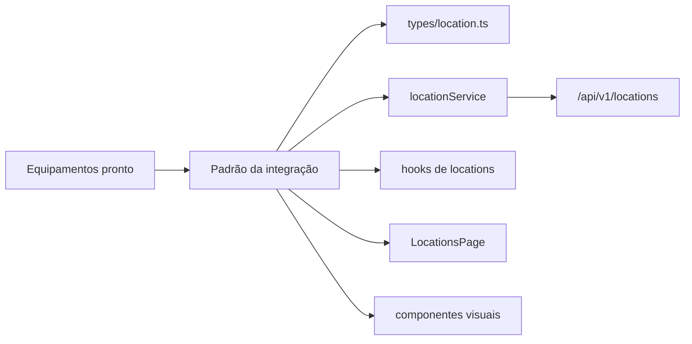

# Aula 08 - Módulo de Localizações

Nesta aula, Equipamentos já está integrado com a API.

O objetivo é implementar Localizações seguindo o mesmo padrão usado em Equipamentos: types, service, hooks, página, componentes, estados de loading, erro, lista vazia e atualização após salvar.

## Estado inicial da branch

Já está pronto:

- `frontend/src/services/api.ts` com `axiosApi`;
- Equipamentos integrado com a API;
- utilitários compartilhados em `frontend/src/shared`;
- componentes compartilhados `SummaryCards`, `ResourceFilters` e `DataTable`;
- `locationService` completo com as rotas da API;
- `useLocationList` e `useLocationSummary`;
- página `/locations` com resumo, filtros e tabela usando dados reais.

Falta os alunos implementarem:

- detalhe de localização;
- formulário de criação;
- formulário de edição;
- alteração de status;
- exclusão;
- equipamentos vinculados à localização;
- histórico de movimentações da localização.

## Rotas da API

```txt
GET    /api/v1/locations
GET    /api/v1/locations/summary
GET    /api/v1/locations/:locationId
POST   /api/v1/locations
PUT    /api/v1/locations/:locationId
PATCH  /api/v1/locations/:locationId/status
DELETE /api/v1/locations/:locationId
GET    /api/v1/locations/:locationId/equipment
GET    /api/v1/locations/:locationId/equipment-history
```

## Fluxo visual



## Ordem sugerida

1. Revisar Equipamentos funcionando com API.
2. Abrir `types/location.ts`.
3. Conferir `locationService.ts`.
4. Criar hooks que faltam.
5. Conferir filtros, cards e tabela compartilhados.
6. Adicionar ações na tabela.
7. Criar modal de formulário.
8. Criar modal de status.
9. Criar tela de detalhes.
10. Integrar exclusão.

## Reaproveitamento visual já iniciado

Nesta branch, os componentes repetidos mais óbvios já foram movidos para `shared`:

```txt
frontend/src/shared/components/SummaryCards
frontend/src/shared/components/ResourceFilters
frontend/src/shared/components/DataTable
frontend/src/shared/components/PageHeader
```

Eles já são usados por Equipamentos e Localizações.

Recomendação para a continuação da aula: copiar primeiro, depois extrair para `shared` quando a repetição ficar clara.

Pode copiar de Equipamentos:

- `EquipmentFormModal` para criar `LocationFormModal`;
- `EquipmentStatusModal` para criar `LocationStatusModal`;
- `EquipmentRemoveModal` para criar `LocationRemoveModal`;
- `DetailsHeader` para criar um cabeçalho de detalhe;
- `DetailSummaryCards` para os cards do detalhe.

Bons próximos candidatos para `shared`:

- modal de confirmação de exclusão;
- badge de status, se a variação por módulo for pequena;
- cabeçalho de detalhes.

O `PageHeader` já ficou compartilhado e recebe `title`, `description`,
`actionLabel` e `onAction`.

Nesta branch, `getRequestErrorMessage` e `RequestState` também já foram movidos para `shared`.

## Critérios de aceite

- Equipamentos continua funcionando com API.
- Localizações lista dados reais.
- Localizações cria e edita registros.
- Localizações altera status.
- Localizações remove registros sem equipamentos vinculados.
- Localizações mostra erro quando a API bloquear exclusão.
- Detalhe mostra resumo, equipamentos vinculados e histórico.
- Loading e erro aparecem de forma simples.
