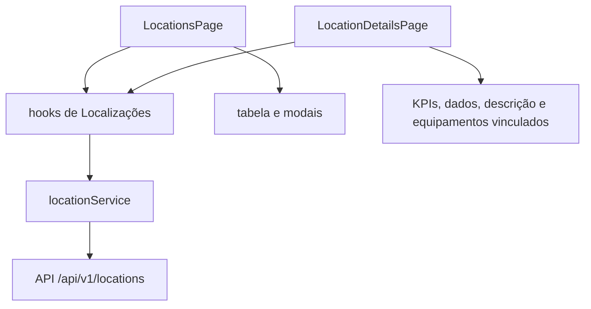

# Aula 08 - Módulo de Localizações resolvido

Esta branch entrega a versão completa do trabalho final de casa. Equipamentos
continua integrado com a API e Localizações agora cobre o fluxo inteiro de
frontend: listagem, filtros, CRUD, alteração de situação, exclusão, detalhe
e equipamentos vinculados no mesmo padrão visual de Equipamentos.

Use este material como roteiro de demonstração e como referência para explicar
a solução pronta aos alunos.

## O que está pronto

- `/locations` lista dados reais vindos de `GET /locations`;
- cards de resumo consomem `GET /locations/summary`;
- busca com debounce, filtro de situação, filtro de tipo e paginação;
- cadastro com `POST /locations`;
- edição com `PUT /locations/:locationId`;
- alteração de situação com `PATCH /locations/:locationId/status`;
- exclusão com `DELETE /locations/:locationId`;
- tratamento de erro com `getRequestErrorMessage`;
- rota dinâmica `/locations/:locationId`;
- detalhe com informações gerais, descrição e equipamentos vinculados;
- hooks de leitura e escrita espelhando o padrão de Equipamentos.
- componentes comuns de detalhe e modais extraídos para `shared/components`.

## Arquitetura da solução



## Fluxos para demonstrar

1. Abrir `/locations` e mostrar cards, filtros e tabela.
2. Buscar por nome, código, prédio ou sala.
3. Filtrar por situação e tipo.
4. Criar um local novo com código em letras maiúsculas, por exemplo `LAB-99`.
5. Editar o local criado.
6. Alterar a situação do local.
7. Tentar excluir um local com equipamentos vinculados para mostrar erro `409`.
8. Excluir um local sem equipamentos vinculados.
9. Abrir detalhes de um local.
10. No detalhe, navegar para um equipamento vinculado.

## Arquivos principais

```txt
frontend/src/features/locations/pages/LocationsPage
frontend/src/features/locations/pages/LocationDetailsPage
frontend/src/features/locations/components/LocationFormModal
frontend/src/features/locations/components/LocationStatusModal
frontend/src/features/locations/components/LocationRemoveModal
frontend/src/features/locations/components/LocationTable
frontend/src/features/locations/components/LocationEquipmentCard
frontend/src/features/locations/hooks
frontend/src/features/locations/services/locationService.ts
frontend/src/features/locations/types/location.ts
frontend/src/shared/components/DetailHeader
frontend/src/shared/components/DetailSummaryCards
frontend/src/shared/components/DetailInfoCard
frontend/src/shared/components/DetailTextCard
frontend/src/shared/components/ResourceRemoveModal
frontend/src/shared/components/ResourceStatusModal
frontend/src/shared/components/StatusPill
```

## Rotas consumidas

```txt
GET    /api/v1/locations
GET    /api/v1/locations/summary
GET    /api/v1/locations/:locationId
POST   /api/v1/locations
PUT    /api/v1/locations/:locationId
PATCH  /api/v1/locations/:locationId/status
DELETE /api/v1/locations/:locationId
GET    /api/v1/locations/:locationId/equipment
```

## Validação antes da aula

Na raiz do frontend:

```txt
npm run lint
npm run build
```

Na raiz do backend:

```txt
npm run build
npm test
```

O `build` do Vite pode avisar sobre chunk acima de 500 kB por causa das
dependências de UI. Esse aviso já existia no projeto e não bloqueia a
demonstração.
