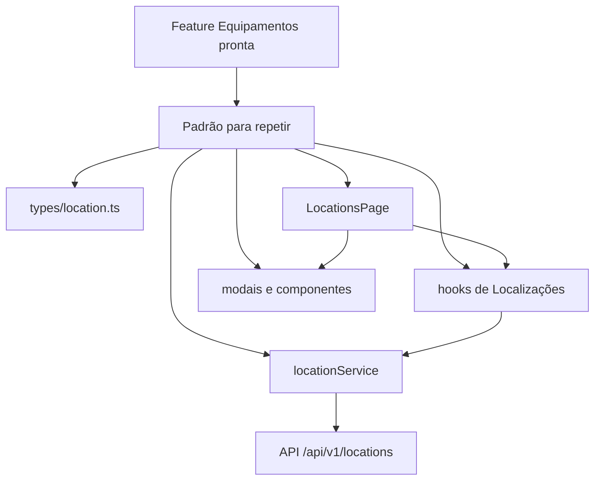
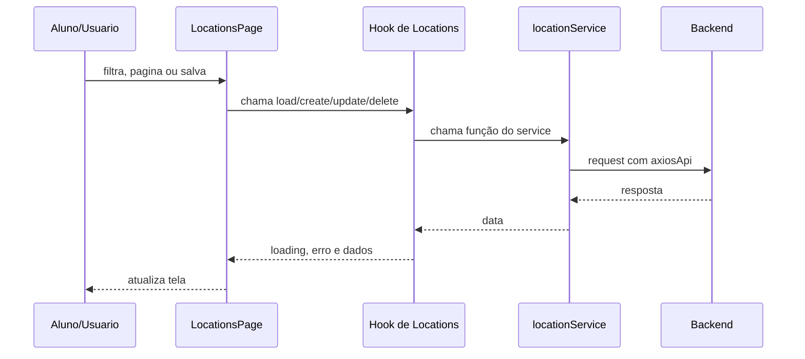

# Aula 08 - Trabalho final de casa: módulo de Localizações

Nesta branch, Equipamentos já está integrado com a API. O trabalho final de casa
é completar Localizações por conta própria, usando Equipamentos como referência.

Este material precisa funcionar sem acompanhamento em sala. A branch deixa a
base visual e as partes mais difíceis semiprontas em comentários, para os alunos
terem um mapa durante o fim de semana, mas ainda precisarem implementar os
hooks, modais e fluxos.

## Estado inicial

Já está pronto:

- `frontend/src/services/api.ts` com `axiosApi`;
- Equipamentos integrado com a API;
- utilitários compartilhados em `frontend/src/shared`;
- componentes compartilhados `PageHeader`, `SummaryCards`, `ResourceFilters` e `DataTable`;
- `locationService` completo com as rotas da API;
- `useLocationList` e `useLocationSummary`;
- página `/locations` renderizando só o cabeçalho;
- blocos comentados em `LocationsPage` para cards, filtros, tabela, ações e modais.

Falta os alunos implementarem:

- hooks de escrita e detalhe;
- ativação da listagem visual comentada;
- filtros e paginação na tela;
- tabela com menu de ações;
- formulário de criação;
- formulário de edição;
- modal de alteração de situação;
- modal de exclusão;
- navegação para detalhe;
- tela de detalhe;
- equipamentos vinculados;
- histórico de movimentações.

## Arquitetura do Trabalho



## Fluxo de comunicação



## Ordem recomendada

1. Revisar a feature de Equipamentos funcionando.
2. Ler `frontend/docs/aula-08/README-alunos.md`.
3. Entender `types/location.ts` e `locationService.ts`.
4. Conferir os blocos comentados de `LocationsPage`.
5. Ativar cards, filtros e tabela usando os blocos 1 a 5.
6. Criar os hooks que faltam.
7. Criar os modais de formulário, situação e exclusão.
8. Substituir mensagens temporárias por ações reais.
9. Criar a rota e a página de detalhe.
10. Validar loading, erro, estado vazio e reload depois de salvar.

## Organização para o Fim de Semana

Oriente os alunos a não tentar resolver tudo de uma vez. A sequência de entrega
mais saudável é:

1. deixar `/locations` listando dados reais;
2. fazer criação e edição;
3. fazer alteração de situação;
4. fazer exclusão com tratamento de erro;
5. fazer detalhe, equipamentos vinculados e histórico;
6. rodar lint/build e conferir o checklist.

Cada etapa deve ser testada no navegador antes de seguir para a próxima.

## Blocos semiprontos

O arquivo abaixo começa renderizando apenas o `PageHeader`. O restante fica em
blocos comentados:

```txt
frontend/src/features/locations/pages/LocationsPage/index.tsx
```

Use os blocos nesta ordem:

1. imports;
2. helpers dos cards/endereço;
3. colunas da tabela;
4. estados, hooks e handlers;
5. JSX dos elementos visuais;
6. modais de criar, editar e excluir.

A ordem mais segura é ativar um bloco por vez e testar antes de seguir.

## Rotas da API

```txt
GET    /api/v1/locations
GET    /api/v1/locations/summary
GET    /api/v1/locations/:locationId
POST   /api/v1/locations
PUT    /api/v1/locations/:locationId
PATCH  /api/v1/locations/:locationId/status
DELETE /api/v1/locations/:locationId
GET    /api/v1/locations/:locationId/equipment
GET    /api/v1/locations/:locationId/equipment-history
```

## Reaproveitamento visual

Já estão em `shared`:

```txt
frontend/src/shared/components/PageHeader
frontend/src/shared/components/SummaryCards
frontend/src/shared/components/ResourceFilters
frontend/src/shared/components/DataTable
```

Podem ser copiados de Equipamentos para Localizações:

- `EquipmentFormModal` -> `LocationFormModal`;
- `EquipmentStatusModal` -> `LocationStatusModal`;
- `EquipmentRemoveModal` -> `LocationRemoveModal`;
- `DetailsHeader` -> cabeçalho de detalhe de localização;
- `DetailSummaryCards` -> cards do detalhe.

## Critérios de aceite

- Equipamentos continua funcionando com API.
- Localizações lista dados reais.
- Busca, status, tipo e paginação funcionam.
- Criação e edição salvam na API.
- Alteração de situação usa `PATCH /locations/:locationId/status`.
- Exclusão usa `DELETE /locations/:locationId`.
- Erro da API aparece quando a exclusão for bloqueada.
- Detalhe carrega pelo ID da URL.
- Detalhe mostra informações gerais, equipamentos vinculados e histórico.
- A tela mantém loading, erro e estado vazio simples.
